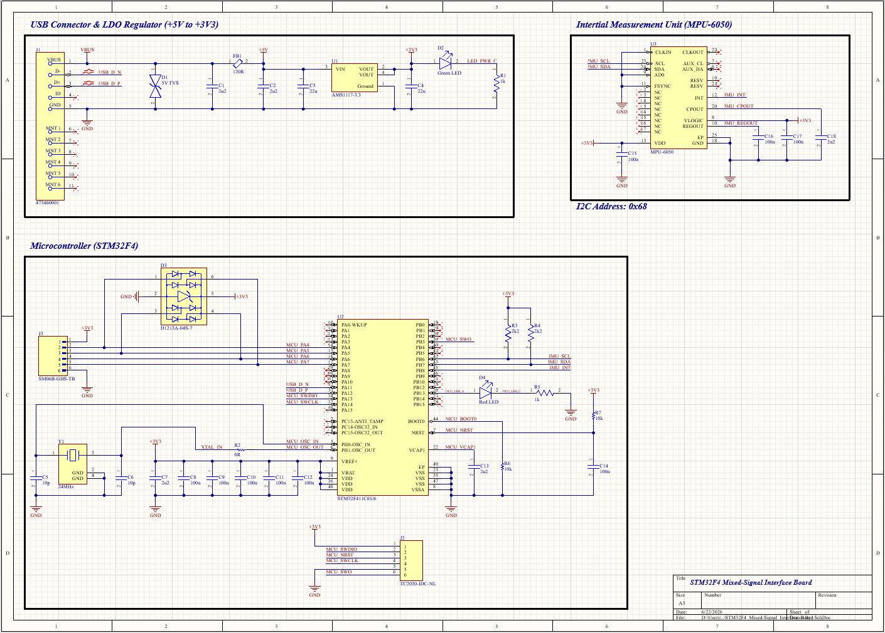
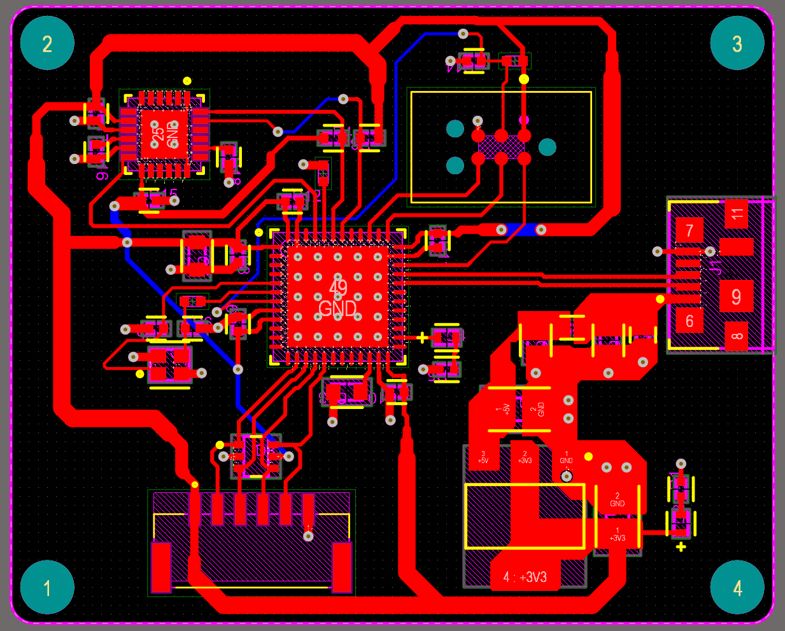
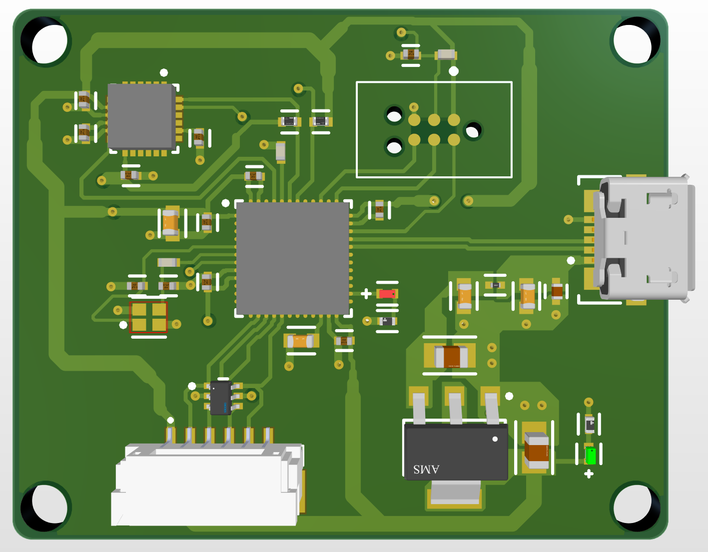

# STM32F4 Mixed-Signal Interface Board

A 4-layer STM32F4-based mixed-signal interface PCB designed in Altium Designer as a proof-of-concept embedded hardware project. The board integrates USB input power, 3.3 V regulation, SWD programming/debug access, an MPU-6050 IMU interface, external expansion I/O, ESD/TVS protection, decoupling, and fabrication-ready design outputs.

This project was created to practice the end-to-end PCB design workflow: schematic capture, component selection, footprint integration, PCB layout, design-rule checking, fabrication output generation, and technical documentation.

## Project Preview

### Schematic



### PCB Layout



### 3D View



## Project Goals

The goal of this board was to design a compact embedded electronics platform that exercises several common hardware design areas:

* MCU-based schematic and PCB design
* USB input power and 3.3 V regulation
* External connector ESD protection
* Sensor/IMU interface design
* SWD programming/debug access
* Local decoupling and power distribution
* 4-layer PCB layout workflow
* DRC cleanup and fabrication file generation
* Documentation for review and future bring-up

## Features

| Area                 | Implementation                                               |
| -------------------- | ------------------------------------------------------------ |
| MCU                  | STM32F411CEU6                                                |
| IMU                  | MPU-6050 over I2C                                            |
| Power Input          | USB VBUS                                                     |
| Regulation           | AMS1117-3.3 LDO                                              |
| USB Protection       | TVS diode from VBUS to GND                                   |
| Expansion Protection | D1213A-04S-7 4-channel ESD array on PA4–PA7                  |
| Debug                | TC2030-IDC-NL Tag-Connect SWD connector                      |
| Clocking             | 24 MHz external crystal                                      |
| PCB                  | 4-layer Altium Designer layout                               |
| Outputs              | Schematic PDF, fabrication zip, DRC report, and source files |

## Hardware Overview

### USB Power Input

USB VBUS enters through the USB connector, is protected with a TVS diode to GND, filtered through a ferrite bead, and regulated to 3.3 V using an AMS1117-3.3 LDO.

### STM32F4 Microcontroller

The STM32F411CEU6 is the main controller. The design includes local decoupling, boot/reset circuitry, SWD programming/debug access, USB data connections, and external expansion signals.

### External Expansion Connector

The SM06B-GHS-TB connector exposes 3.3 V, GND, and four STM32 GPIO signals.

| Pin | Net     |
| --: | ------- |
|   1 | +3V3    |
|   2 | MCU_PA4 |
|   3 | MCU_PA5 |
|   4 | MCU_PA6 |
|   5 | MCU_PA7 |
|   6 | GND     |

The PA4–PA7 lines are protected by a D1213A-04S-7 4-channel ESD diode array placed near the connector.

### IMU Interface

The MPU-6050 is connected over I2C with pull-up resistors on SDA and SCL. Local support capacitors are included near the device supply, REGOUT, and CPOUT pins.

### SWD Debug Interface

A TC2030-IDC-NL Tag-Connect footprint provides SWD programming and debug access through SWDIO, SWCLK, NRST, SWO, 3.3 V, and GND.

## PCB Layout Notes

Layout work focused on:

* Placing ESD/TVS protection close to external connectors
* Keeping decoupling capacitors close to MCU and IMU supply pins
* Routing USB D+ and D− cleanly from the USB connector to the MCU
* Managing power and ground polygons across a 4-layer stackup
* Creating local design-rule exceptions for fine-pitch MPU-6050 pad clearances
* Resolving routing, via, keepout, polygon, and DRC issues during layout

## Design Rule Check Status

At the time of export:

| Check                           | Status                                                   |
| ------------------------------- | -------------------------------------------------------- |
| Electrical clearance violations | Resolved                                                 |
| Short-circuit violations        | Resolved                                                 |
| Unrouted nets                   | Resolved                                                 |
| Width violations                | Resolved                                                 |
| Hole-size violations            | Resolved                                                 |
| Remaining warnings              | Solder-mask sliver warnings around fine-pitch footprints |

The remaining solder-mask sliver warnings are treated as fabrication/assembly considerations rather than unresolved electrical design issues.

## Repository Structure

```text
.
├── Docs/
│   ├── Design Rule Check - STM32F4_Mixed-Signal_Interface_Board_PCB.drc
│   ├── STM32_Mixed-Signal_Interface_Board.pdf
│   └── Status Report.Txt
├── Fabrication/
│   └── gerber-and-drill-files.zip
├── Images/
│   ├── pcb-2d.png
│   ├── pcb-3d.png
│   └── schematic.png
├── Source/
│   ├── STM32F4_Mixed-Signal_Interface_Board.PrjPcb
│   ├── STM32F4_Mixed-Signal_Interface_Board.SchDoc
│   └── STM32F4_Mixed-Signal_Interface_Board_PCB.PcbDoc
└── README.md
```

## Project Status

This board is currently a proof-of-concept PCB design project. It has not yet been fabricated or electrically validated.

Planned bring-up steps:

1. Inspect PCB and assembly under magnification.
2. Check for shorts between +3V3 and GND.
3. Verify USB VBUS input.
4. Verify 3.3 V regulator output.
5. Connect SWD programmer and detect the STM32F411.
6. Flash basic GPIO test firmware.
7. Verify USB connectivity.
8. Verify I2C communication with the MPU-6050.
9. Read the MPU-6050 `WHO_AM_I` register.
10. Test expansion connector GPIO/SPI-style signals.

## Known Limitations

* The board has not yet been fabricated.
* The board has not yet been electrically tested.
* Firmware bring-up has not yet been completed.
* Some footprints were sourced from third-party libraries and should be verified against manufacturer datasheets before fabrication.
* Remaining DRC warnings are solder-mask sliver warnings around fine-pitch footprints.

## Skills Demonstrated

* Altium Designer schematic capture and PCB layout
* MCU-based embedded board design
* USB power input and 3.3 V regulation
* ESD/TVS protection for external-facing connectors
* I2C peripheral integration
* SWD debug/programming interface design
* Decoupling and power distribution
* 4-layer PCB layout workflow
* DRC troubleshooting and rule management
* Fabrication output generation
* Hardware design documentation

## License

This project is provided for portfolio and educational purposes.


